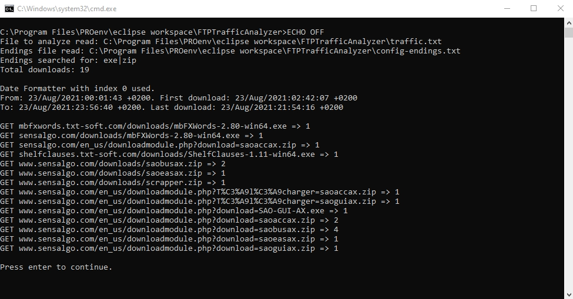

# FTPTrafficAnalyzer
to get console download statistics from standard FTP 'logs' files

Version 1.00

 

Compiler compliance level 11, so you need OpenJDK 11 or later separately installed to run
the program. Make sure console/terminal is shown on execution.

TXTrafficAnalyzer application expects text file "traffic.txt" (lower-case) in application directory
to extract how many downloads are indicated and what files, according to
files's names and paths, have been downloaded.

 
- You can see the links used to your download files.
  This is useful to keep or get these links alive. Also dead links
  cause some traffic, so it is an option to support these
  for more valid downloads.
- The time range of the file is extracted, additionally date and time
  of first and last download are given out. 
- Very small project, Eclipse without build tool.
 
EXE and .ZIP download files are extracted and counted per default.
To get statistics for other file endings simply change content of file "config-endings.txt"
in application main directory. In each line name the extension to evaluate.
Instead of download statistics you can achieve click statistics to the pages of your site,
so use htm, html instead of zip and exe.
 
Via command line parameter you can specify different name of the logging file
(with absolute or path relative to application directory) to be analyzed.
Instead you can use named parameters, for example:
"logfile=traffic.txt" "endingsfile=config-endings.txt"
(what are the default values). Parameter HELP gives out explanation to command line
parameters.
 
To get a suitable file containing this logging information go via your host's FTP to directory
"logs". There you find suitable files, for example:
- "access.log.26.gz" for the calendar week 26
- "access.log.34.4.gz" for the calendar week 34 and the 4th day of the week, that is Thursday
These files are all zipped, so unzip for example to "access.log.34.4".
Do not forget to copy to application directory and rename to "traffic.txt".
